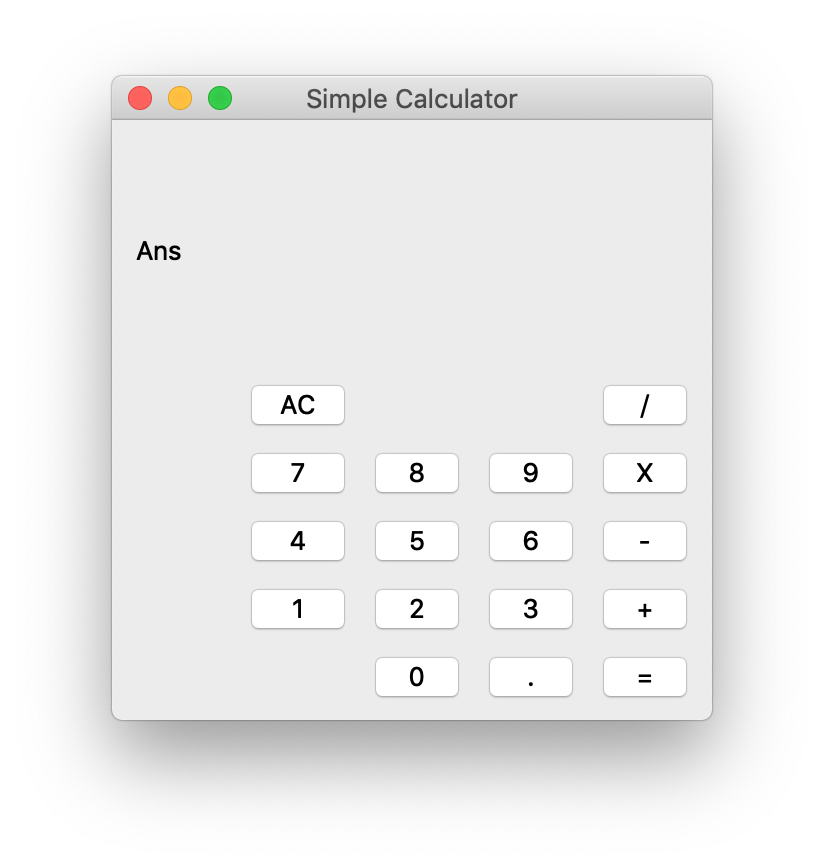
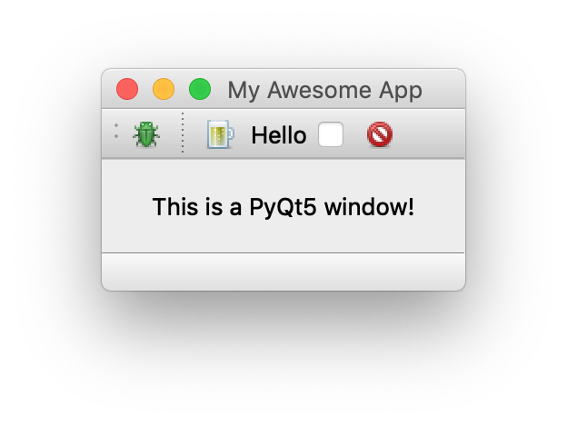

# PyQt5 Python GUI
 Simple Calculator for using [PyQt5](https://pypi.org/project/PyQt5/) GUI library for python. PyQt is the the python port for [Qt](https://www.qt.io), which is a set of cross-platform C++ libraries that implement high-level APIs for accessing many aspects of modern desktop and mobile systems. In the src directory is a fbs project to create a stand alone python executable which will have matplotlib graphs within the app, though this is still a work in progress.
 
## simple-calc.py

The simple-calc.py script is a simple calculator which only has basic operations available. Still a bit buggy

## helloworld.py

Introduction to PyQt5 GUI Python library.

## fugue-icons-3

Icons used in this project are from [here](https://p.yusukekamiyamane.com) under a [Creative Commons Attribution 3.0 License](https://creativecommons.org/licenses/by/3.0/)